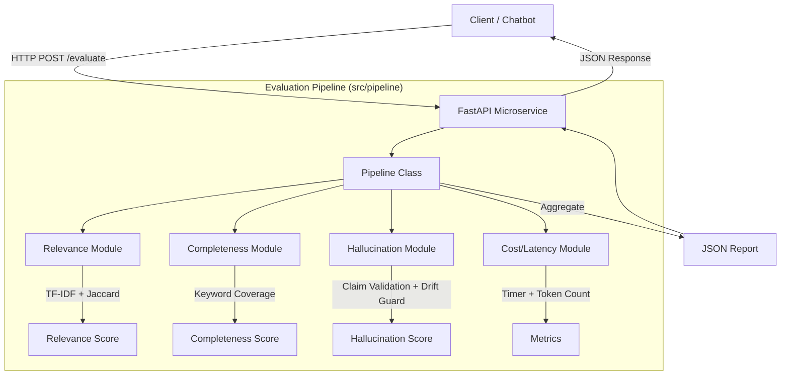

# System Architecture

## High-Level Diagram

## Component Breakdown

### 1. API Layer (`src/api.py`)
- **Technology**: FastAPI, Uvicorn.
- **Role**: Entry point. Validates input JSON schema using Pydantic models. Handles HTTP errors and serialization.

### 2. Orchestrator (`src/pipeline/evaluation.py`)
- **Role**: The "Manager". It initializes all evaluators and runs them sequentially. It contains the business logic for the final "Verdict" (PASS/FAIL/WARN).

### 3. Evaluator Modules
- **Relevance (`src/pipeline/relevance.py`)**:
    - Uses `TfidfVectorizer` to convert text to vectors.
    - Computes Cosine Similarity.
    - Fallback to Jaccard Similarity for short texts.
- **Completeness (`src/pipeline/completeness.py`)**:
    - Extracts keywords from the Query.
    - Checks what percentage of these keywords exist in the Response.
- **Hallucination (`src/pipeline/hallucination.py`)**:
    - **Claim Verification**: Extracts and verifies anchors (Numbers, Dates, Assertive Claims) against Context.
    - **Topic Drift Gate**: Uses N-grams to penalize only completely off-topic responses.
- **Cost (`src/pipeline/latency_cost.py`)**:
    - Simple timer and character-based token estimation.

## Data Flow
1.  **Request**: Client sends `{query, response, context}`.
2.  **Validation**: API checks if fields are non-empty.
3.  **Processing**: Pipeline runs all 4 modules.
4.  **Aggregation**: Scores are combined. Thresholds are checked (e.g., if Hallucination > 0.5 -> FAIL).
5.  **Response**: Client receives `{metrics, verdict}`.
